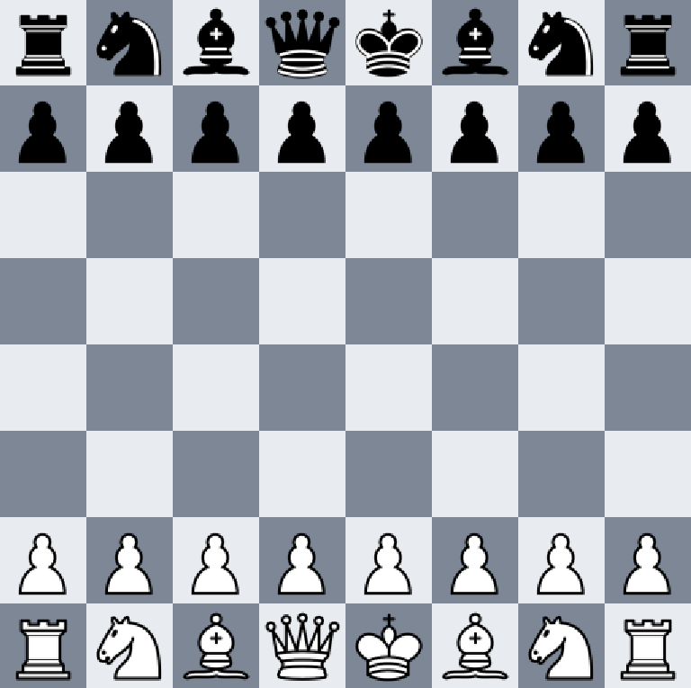

### program requirement:
Java runtime installed
### How to run the program:
1. run the file
2. start playing by dragging chess piece to the valid grid
3. check console/terminal to see whose turn it is, and warning for invalid move(if you drag your piece to an invalid position, it wouldn't register, and you would be asked to move to a valid position)
4. if you or your opponent manages to kill the other's king, the program will be terminated, and the winner will be displayed in the console/terminal
### This is what java runtime will display when the program first run.

